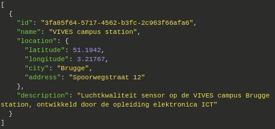
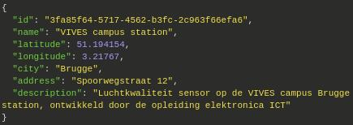

# Particula Backend

## install

```bash
composer install
```

## make .env

coppy the .env.examble  
and change the name to .env

## make a mysql db

make sure your db_name in the env file is the same of
the one you use for your mysql db

## to start-up

```bash
vendor/bin/phinx migrate  
php -S localhost:3000 -t public
```

## create new table

vendor/bin/phinx create MyNewMigration

## api-data-influxdb

De Hisorische data kan je opvragen door volgende stappen te volgen.
Eerst roepen we de server aan op de poort
van de backend, hier vermelden we bij
dat we de meetingen willen opvragen:

```http
http://develop.particula.devbitapp.be:8080/measurements
```

door hierbij het id toe te voegen krijg je een specifieke sensor:

```http
http://develop.particula.devbitapp.be:8080/measurements/nico-prototype-l432
```

Om data te kunnen weergeven moet je een periode en een propertie toevoegen:

```http
http://develop.particula.devbitapp.be:8080/measurements/nico-prototype-l432?period=1d&properties=pm25
```

in dit geval voegen we de pm2.5 waarde van de sensor
van nico dit van de afgelopen 24h.

Dit kan ook weergegeven worden dankzij insomnia:


Extra informatie in verband met de structuur van deze
toepassing is te vinden op `https://app.swaggerhub.com/apis-docs/sillevl/Particula/0.1#/`

## Routes for MariaDB

`Sensors` and `Users` are stored in a MariaDB database and can
be managed with the information provided in this chapter.

### Sensors

The sensors table can be managed using GET, POST, PUT and DELETE request.
More information about each request is listed bellow.

All sensors with their information can be obtained with following GET request:

```http
GET http://<ip>:<port>/sensors
```

The format of the result is specified at
[SwaggerHub](https://app.swaggerhub.com/apis-docs/sillevl/Particula/0.1#/)
, for example:



A sensor can be added to the database sending following POST request:

```http
POST http://<ip>:<port>/sensors
```

A sensor can only be created if all information is entered:



A sensor can be edited by using the sensor id:

```http
PUT http://<ip>:<port>/sensors/{id}
```


Finally a sensor can be removed by its id:

```http
DELETE http://<ip>:<port>/sensors/{id}
```

### Users

Users can be managed using a GET, POST, PUT or DELETE request.
More information about each request and its output can be found underneath.

A list of users can be found using:

```http
GET http://<ip>:<port>/users
```


The information of one user can be found by adding
the username to the previous request:

```http
GET http://<ip>:<port>/users/{username}
```

A new user can be added as follows:

```http
POST http://<ip>:<port>/users
```

A user can only be added if all of the following information is provided:


A user can be updated by its username:

```http
PUT http://<ip>:<port>/users/{username}
```


At last a user can be deleted using a username:

```http
DELETE http://<ip>:<port>/users/{username}
```

## Development

### Linter

Check if the code complies to the PSR2 recommendations
with the following command:

```bash
composer lint
```

### Linter autofix

Some Linter errors and warnings can be fixed automatically.
Use the following composer command:

```bash
composer lint-fix
```

### Migrations

To run a database migration use the command:

```bash
composer migrate
```

### Unfinished

- Back-end API & Authentication API have the same functionality implemented
  - Authentication API uses query's from back-end
- Particle from SwaggerHub is not implemented
- Non-existing sensor should return 404
