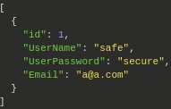

# Particula Backend

## install

```bash
composer install
```

## make .env

coppy the .env.examble  
and change the name to .env

## make a mysql db

make sure your db_name in the env file is the same of
the one you use for your mysql db

## to start-up

```bash
vendor/bin/phinx migrate  
php -S localhost:3000 -t public
```

## create new table

vendor/bin/phinx create MyNewMigration

## api-data-influxdb

The historical data is accessible by following these steps.
The measurements of a sensor can be requested via the following url using its GUID.

```http
https://develop.particula.devbitapp.be/measurements/{GUID}
```

To be able to display data you have to enter a period:
(Available values: 1h, 24h, 7d, 30d, 1y, 3y, all)

Default value : 24h

```http
https://develop.particula.devbitapp.be/measurements/{GUID}?period=1h&properties=pm2.5
```

in this case we add the pm2.5 value of the sensor for the past 1h.

This can also be displayed thanks to insomnia:


When values greater than 1h (24h, 7d, 30d, 1y, 3y, all) are requested,
averages are used so that the number of responses is limited to 300-400.
When you request data that is not yet in the database,
you will receive NULL for the nonexistent data as shown below.


Additional information related to the structure of this application
can be found at:
[SwaggerHub Particula](https://app.swaggerhub.com/apis-docs/sillevl/Particula)

## Routes for MariaDB

`Sensors` and `Users` are stored in a MariaDB database and can
be managed with the information provided in this chapter.

### Sensors

The sensors table can be managed using GET, POST, PUT and DELETE request.
More information about each request is listed bellow.

All sensors with their information can be obtained with following GET request:

```http
GET http://<ip>:<port>/sensors
```

The format of the result is specified at
[SwaggerHub](https://app.swaggerhub.com/apis-docs/sillevl/Particula/0.1#/)
, for example:


A sensor can be added to the database sending following POST request:

```http
POST http://<ip>:<port>/sensors
```

A sensor can only be created if all information is entered:


A sensor can be edited by using the sensor id:

```http
PUT http://<ip>:<port>/sensors/{id}
```


Finally a sensor can be removed by its id:

```http
DELETE http://<ip>:<port>/sensors/{id}
```

### Users

Users can be managed using a GET, POST, PUT or DELETE request.
More information about each request and its output can be found underneath.

A list of users can be found using:

```http
GET http://<ip>:<port>/users
```



The information of one user can be found by adding
the username to the previous request:

```http
GET http://<ip>:<port>/users/{username}
```

A new user can be added as follows:

```http
POST http://<ip>:<port>/users
```

A user can only be added if all of the following information is provided:


A user can be updated by its username:

```http
PUT http://<ip>:<port>/users/{username}
```


At last a user can be deleted using a username:

```http
DELETE http://<ip>:<port>/users/{username}
```

## Development

### Linter

Check if the code complies to the PSR2 recommendations
with the following command:

```bash
composer lint
```

### Linter autofix

Some Linter errors and warnings can be fixed automatically.
Use the following composer command:

```bash
composer lint-fix
```

### Migrations

To run a database migration use the command:

```bash
composer migrate
```

### Unfinished

- Back-end API & Authentication API have the same functionality implemented
  - Authentication API uses query's from back-end
- Particle from SwaggerHub is not implemented
- Non-existing sensor should return 404

## Mqtt-Broker

This repository contains the mqtt broker used for realtime data
transmission between the lorawan listener and the frontend application.
Currently, the broker will be run on the users localhost, this can be
changed by changing the host variable in `broker.js`.
Same goes for connecting a client or publisher.

### Installation guide

To be able to use the mqtt broker you must complete the following steps.

- Clone the repo into your local folder with `git clone`
- Run the command `npm i`
- Run broker.js with the command `node broker.js`
- The broker is now running on your device

### Examples

In the examples map you can find examples of a basic publisher and client
integrated in a frontend, the view engine for data in frontend is ejs.
To use these examples yourself, you can change the `topic` variable in
`pub.js`. Do the same for the `topic` variable in sub.js.
After you run the `pub.js` file with the command `node pub.js`.

Now you have a publisher running which uploads the message `hello world`
every 5 seconds. You can change this message to any value you see fit.
To be able to display the published values in the frontend of your
webapplication you need to grab the code from `sub.js` and change the
topic to the topic your publisher has.

After you have done this you are subscribed to your publisher and you can 
use the values you have received as you see fit.

