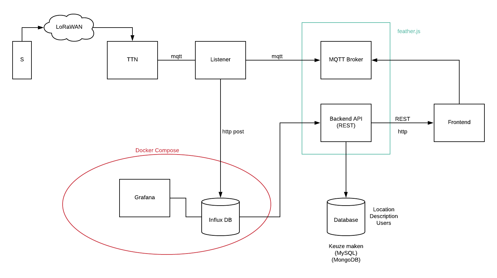
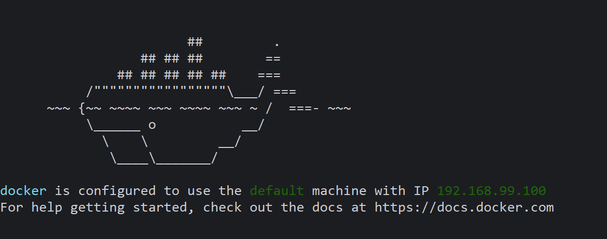
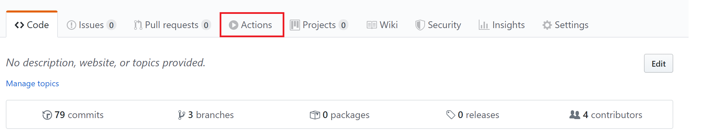
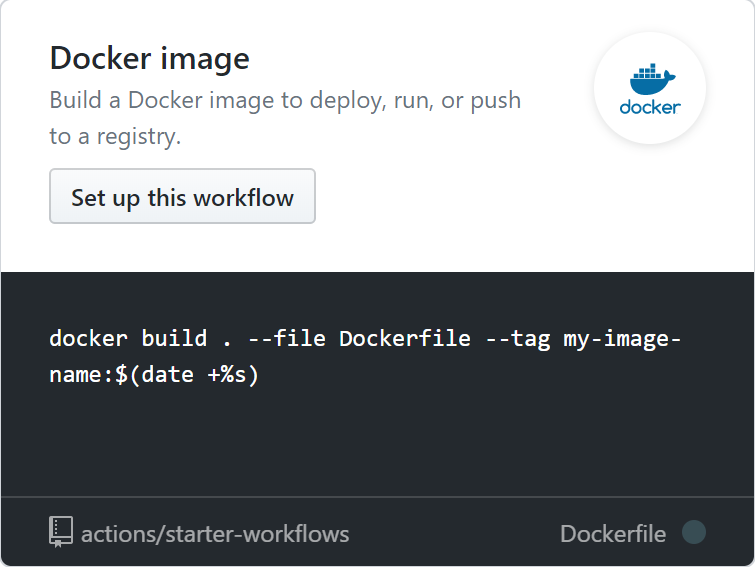

# particula-docker-compose

[GitHub homepage](https://github.com/vives-projectwerk-2-2020/particula-docker-compose)

## UML diagram



## Docker and Docker Compose introduction

### What is Docker

Docker contains your code.

The Docker files in the frontend & backend project are
the building blocks for the `docker-compose`.

With `docker-compose` we load the Docker files, which installs
the required packages & services we need to run the code.

### Installing Docker

#### Installation on Linux

```bash
sudo apt-get install docker
sudo apt-get install docker-compose
```

#### Installation on Windows

You need to get the docker toolbox.
`https://github.com/docker/toolbox/releases`

Get the latest `.exe` version for the toolbox.


You can run the `Docker Quickstart Terminal` to use the Docker environment.


Run the terminal and wait a couple of moments until the
terminal is open and active. You will get a `machine IP`.



This IP is very important to connect to your local containers.
-> More about this later

### Important Commands

#### To run the docker-compose file

##### Run onn Linux

```bash
sudo docker-compose up -d --build
```

##### Run on Windows

In Docker Quickstart Terminal:

```bash
docker-compose up -d --build
```

#### To check the running containers

```bash
docker ps
```

#### Killing containers

```bash
docker kill
```

You can use this command to kill 1 container that you
select by selecting `container name or container id`

Example:

```bash
docker kill particula-docker-compose_frontend_1
```

#### Killing all containers

```bash
docker kill $(docker ps -q)
```

## Containers

The project uses 9 containers in total,
this section gives a bit more information about them.
For more detailed information about them
there will be a link to the github repo if applicable.

### Traefik

For the communication between all containers Traefik is used,
this means there is no need to leave any port open.
This service is configured to use a `HTTP challenge` for HTTPS
which requires to create a empty `acme.json` file.
The Traefik dashboard can be visited at `traefik.<host>`
and is secured with a login, the user can be configured
in `docker-compose.yml` under `traefik` change the `basic auth` labels.
For more information about Traefik ["click here"](https://docs.traefik.io).

### Frontend

More information about the frontend can be found at:
[GitHub](https://github.com/vives-projectwerk-2-2020/Frontend).

### Grafana

To quickly view the data of a sensor a Grafana dashboard
is made and is mapped on a subdomain `grafana.<host>`.

### InfluxDB

The data from a sensor is send to a InfluxDB,
more information about the data can be found in the backend project at:
[GitHub](https://github.com/vives-projectwerk-2-2020/back-end).

### LoRaWAN

The LoRaWAN container connects to The Things Network
and sends the data to the InfluxDB.

### MQTT

An MQTT container is setup as a broker to be able to send
live data to the Frontend.

### Authentication api

The login page of the frontend uses an authentication api
which is running in this container.
More information about this api can be found at:
[GitHub](https://github.com/vives-projectwerk-2-2020/Authentication-API).

### Backend

The Backend container houses the api for retrieving information about
sensors and their measurements. More information about
the routes available can be found at:
[GitHub](https://github.com/vives-projectwerk-2-2020/back-end).

### DB

The final container DB uses the MariaDB image and provides
the data for the backend.

## Environment variables

For this project quite a few environment variables are used in a `.env` file.
The first ones being for setting the domain name which is set to `localhost`
by default. Followed by the branch you want to use to quickly switch
between `master` and `develop`.

```bash
DOMAIN=localhost
BRANCH=
```

Next are the variables used for connecting to The Things Network and
the IP of our MQTT Broker.

```bash
APP_ID=
ACCESSKEY=
REAL_TIME_IP=
```

After that you will need to configure the InfluxDB, this is where
the sensordata is being send to.

```bash
INFLUX_IP=
INFLUX_PORT=
INFLUX_DB_NAME=
```

A Grafana container is used to have a quick overview
of the sensors and their data.
Sinc this is configured on a subdomain you will need to set a `ROOT_URL` and
the `SUB_PATH` it will be served at. Also the admin user can be preconfigured.

```bash
GF_SERVER_ROOT_URL=
GF_SECURITY_ADMIN_USER=
GF_SECURITY_ADMIN_PASSWORD=
GF_SERVER_SERVE_FROM_SUB_PATH=
```

Next is the MySQL container which stores information about `users`
and `sensors`.

```bash
MYSQL_ROOT_PASSWORD=
MYSQL_DRIVER=
MYSQL_HOST=
MYSQL_DATABASE=
MYSQL_USER=
MYSQL_PASSWORD=
```

At last there is a `authentication-api` for creating and authenticating
users which requires one variable to be set.

```bash
ASPNETCORE_URLS=
```

## Docker Image on the Server

You want to create an image through Github Actions.






See the .github folder in the project for an example.

Make sure `pass` is installed on the server before
adding your personal github tokens to the server.

Now you want to create a personal github token to
load repositories on your server.

Run this command on your server:

```bash
 docker login -u USERNAME docker.pkg.github.com
 -> ACCESTOKEN
```

### Unfinished

- Make Traefik independent from docker-compose
- Continous integration
- Status page
