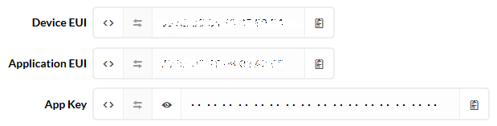

# Using the Particula TTN application (or setting up a new one)

## Adding the particula application to (and setting up) your TTN account

- Make sure you have a TTN user account.
If you don't have one yet, go to [The Things Network](https://www.thethingsnetwork.org/)
and go to the 'Sign Up' page.
- Ask one of the application administrators to add you as a 'collaborator'.
Make sure to provide him/here with your TTN username.
- Once they added you, go to the [TTN Console](https://console.thethingsnetwork.org/applications).
You will find the 'particula' application there.

If you are setting up a new TTN application, skip the second step,
and on the 'applications' page in the console click the 'add application' button.

## Adding a new device

On the 'overview' tab scroll to the 'devices' section
and click the 'register device' button. Now, what do you have to fill out here:

1. Device ID: Give the new device a descriptive name
(if it's for development maybe add your name)
2. Device EUI: click the '🔀' button to generate a random value.
'this field will be generated' should appear in the box next to it.
3. App Key: Leave this as it is. 'this field will be generated'
should also appear in the box.
4. App EUI: This is the key for the application itself (you cannot change this).

## Configuring the firmware

You will need 3 keys to configure the 'particula' firmware for your device
and enable it to connect to TTN.

- devEUI
- appEUI
- appKEY

To get your keys go to the 'devices' tab and select the device you are configuring.

Click the '<>' button to toggle between hex and C-style formating for the keys.
Also make sure to use the 'clipboard' button to copy a key (we don't want typos here).

## Checking the connection

After you've added the 'particula' application and the device to your account,
and configured the firmware with the keys for the device.
It's time to compile the firmware, flash it and check if TTN is receiving the packets.
To do this, go to the 'data' tab.
On the 'devices' tab you can also see colored circles next to all devices.
Green means the device has connected with TTN at least once,
orange means TTN never had communications with that device.

By clicking one of the received payloads you can get an overview of the data
(and metadata) available.

## TTN Payload decoder (When setting up a new TTN application)

You only need to do this if you are setting up a new TTN application:

- Go to the 'Payload Formats' tab when you are in the newly created application
- Copy-paste the code from the 'TTN-Payload-Decoder.js' file here
(file is included in this repo)
- And don't forget to click the 'save' button at the bottom of that page
