# The Particula Frontend

[View the frontend GitHub repo](https://github.com/vives-projectwerk-2-2020/Frontend)

## Install project

### Install

Clone the Particula frontend repository from github. When this is done, change
directory to the cloned directory.

To install all used libraries, use:

```bash
npm install
```

### Start server

```bash
npm run serve
```

### Compiles and minifies for production

```bash
npm run build
```

## Small design presentation

A small presentation of the design of the frontend application.

### Home Page

When you go to the homepage, you will see a map. 
Several markers are placed on this map. every marker shows the location of a sensor.
In the picture below you will see a preview of the homepage.


### Sidebar

For routing between the different pages, you can go to the three striped icon
in the left uppercorner of the webpage. when you click on the this icon, the
sidebar shows up.

here you can see the sidebar :

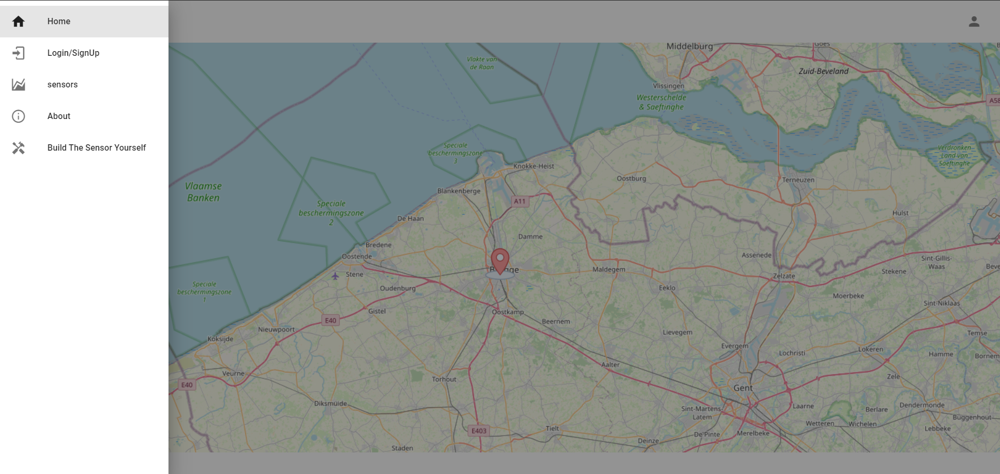

### Login Page

Here users can sign up or log in to the webapp.
With an account they can create and add new sensor to the network.

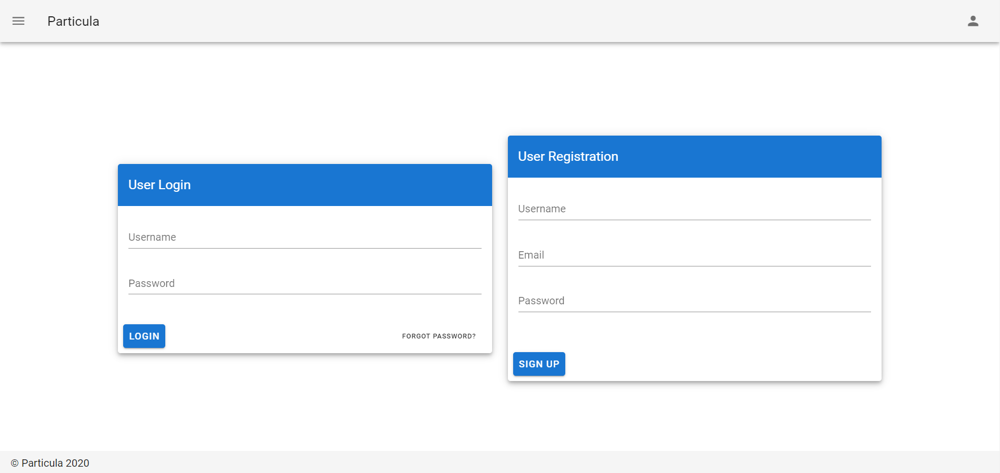

### Profile Page

This is the profile page, where users can view their personal information
and delete their account.

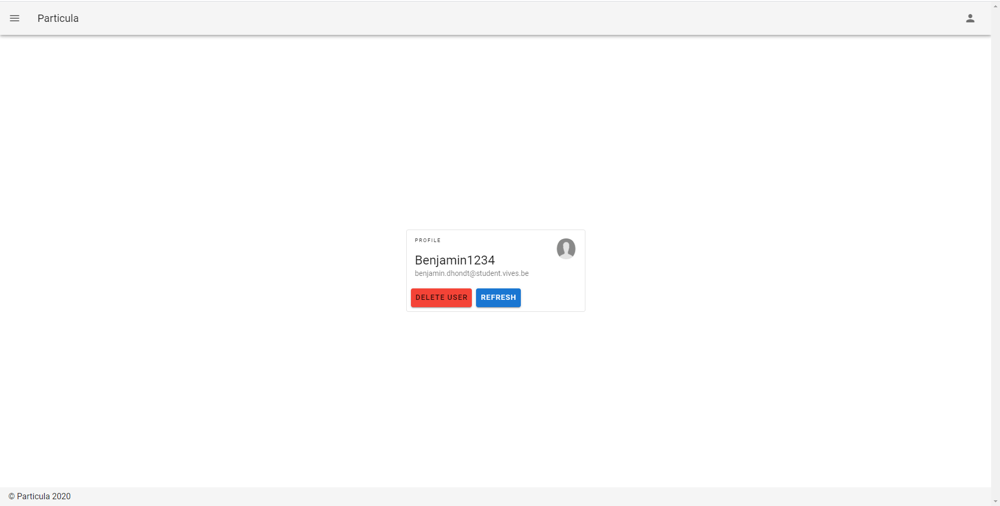

### All Sensors Page

The most important page of the webapp is the all sensors page.
On this page you can see all existing sensors.

From each sensor you can traverse to the sensorpage from this sensor.

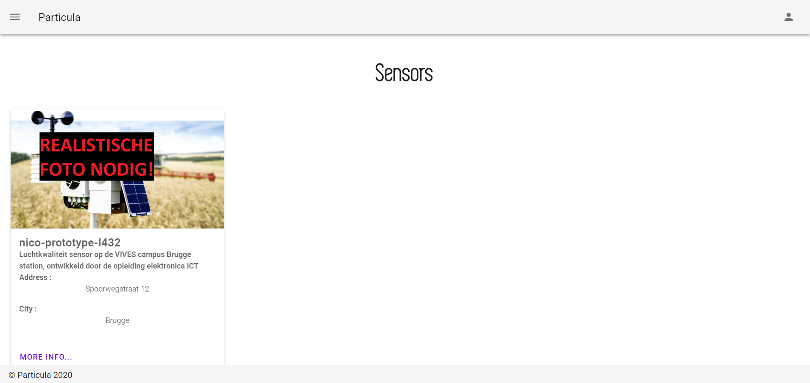

### Sensor Page

For each sensor there is a sensorpage with all the information about that sensor.
Eg. address, city and other location information, but also the sensor's live
values and historical values in graphs.

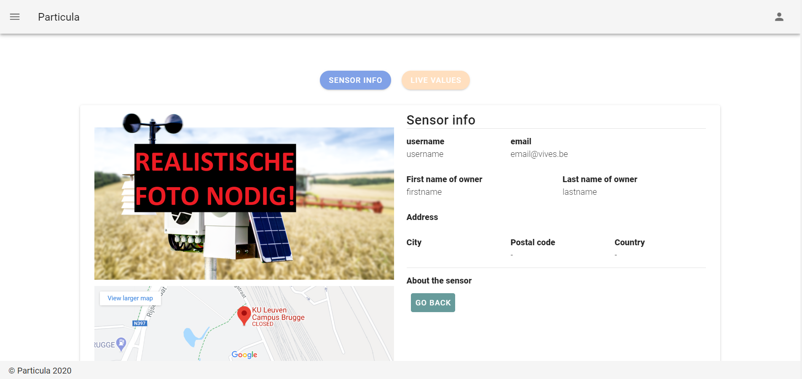

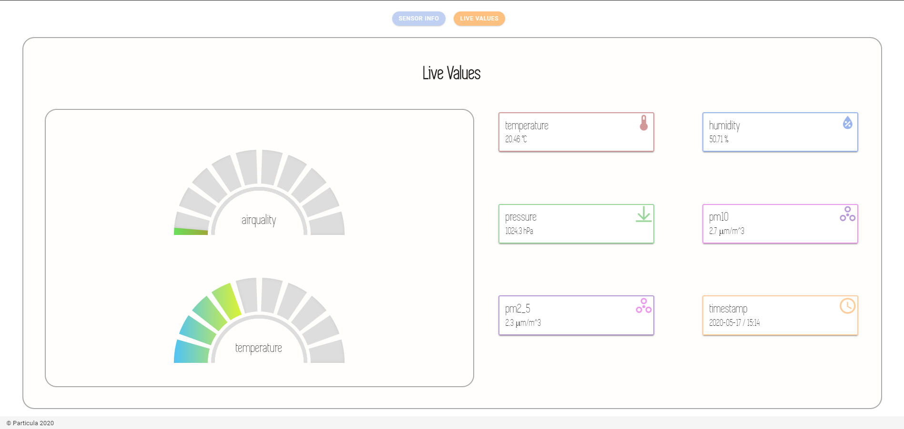

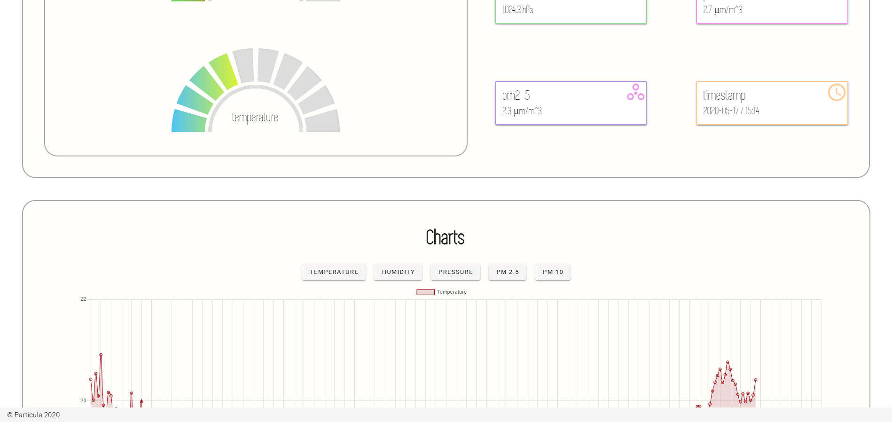

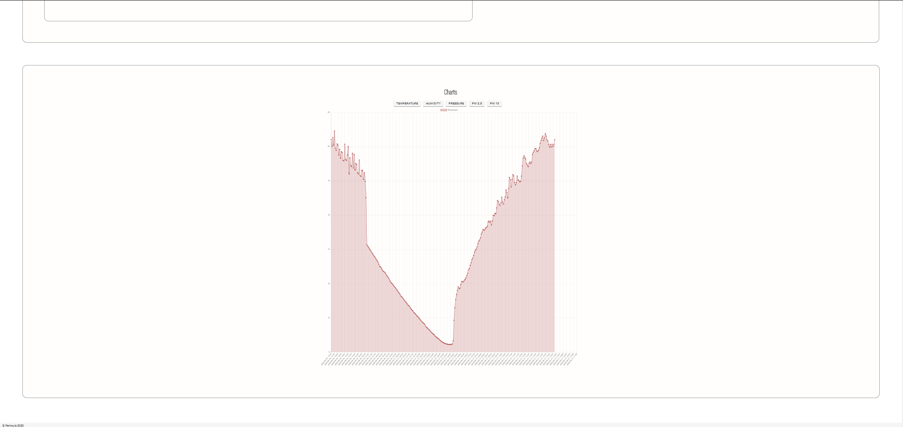

### The 'About' Page

This aboutPage is a special web page on our site where our readers / visitors
learn more about us and what we do. This webpage also tells about VIVES, the end
product and how the site was made. In addition, the story of the journey from
struggling to reaching our ultimate end.

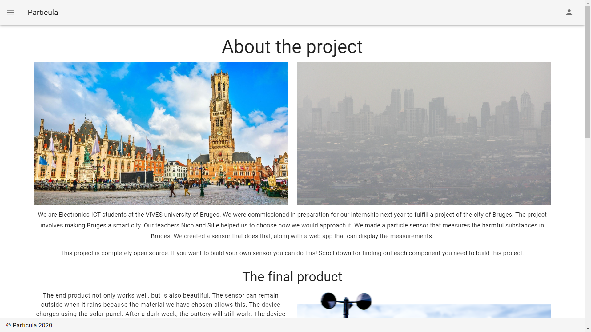

### The 'Build Your Own Sensor' Page

In the 'Build Your Own Sensor', readers / visitors can access all main
components / boards used in our prototype. Each homemade board comes with a
github repository with more info about the board and how to make it,
including schedules. Every other component that we have not designed ourselves
has a purchase link. Some of those components also have a github reposetory
with the necessary firmware and info.

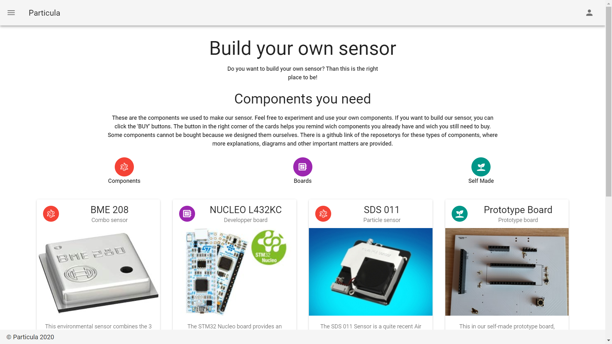

## Background Information

### Login/Registration

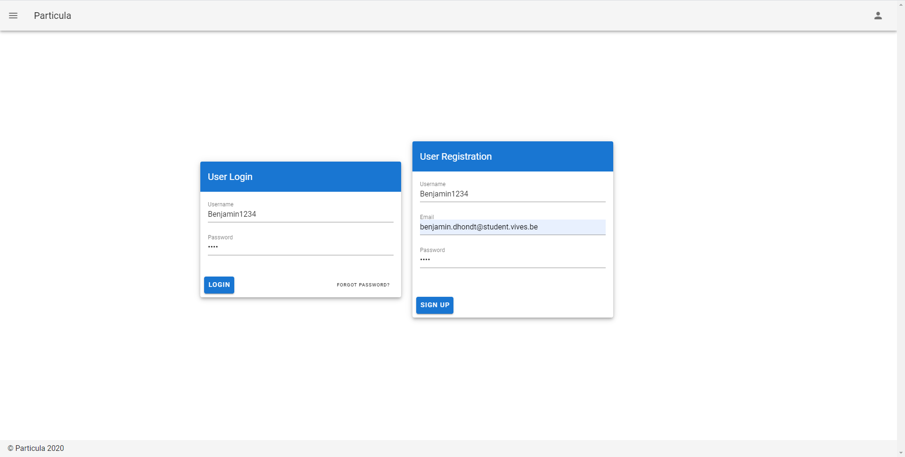

Here people can put their credentials in the sign up section and hereby
put their account in the database.

When they put the right credentials in the login section of the page
a token will appear (temporarily) in the console.
With this token you should authenticate the API requests sending a delete,
edit and getUser signals. At the moment you can use these backend requests
without authenticated requests.

### PWA Implementation

In the frontend there is PWA implementation. This enables the user to directly
download the website from the browser on any supported device.

Just go to chrome for example and install app, like in the example.

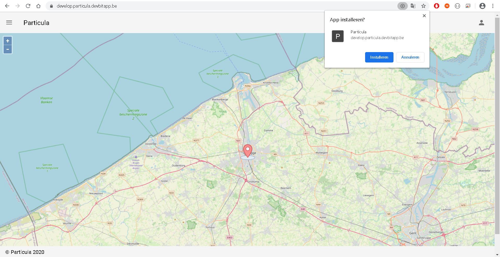
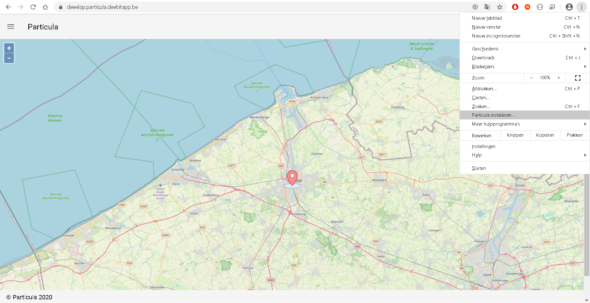
