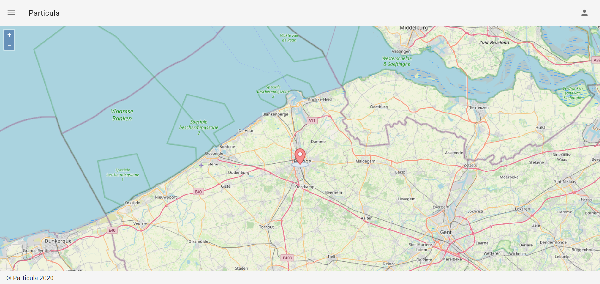

# The Particula Frontend

## Install project

### install

clone the Particula frontend repository from github. When this is done, change
 directory to the cloned directory.

To install all used libraries, use  :

```bash
npm install
```

### Start server

```bash
npm run serve
```

### Compiles and minifies for production

```bash
npm run build
```

## small design presentation

A small presentation of the design of the frontend application.

### Home page

When you go to the hosted webpage, you will see the home page.

Sneak peak homepage :


### Sidebar

For routing between the different pages, you can go to the three striped icon
 in the left uppercorner of the webpage. when you click on the this icon, the
 sidebar shows up.

here you can see the sidebar :


### All Sensors page

The most important page of the webapp is the all sensors page.
On this page you can see all existing sensors.

From each sensor you can traverse to the sensorpage from this sensor.


### Sensor page

For each sensor there is a sensorpage with all the information about that sensor.
Eg. address, city and other location information, but also the sensor's live
 values and historical values in graphs.


### Login Page

Last but not least, the login page. Here users can sign up or log in to the webapp.
With an account they can create and add new sensor to the network.

