# Hardware

## Battery Charge System

### Description

This panel provide a charge system for charing the batteries via a solar cell.
It seems to be very easy to make this, but actually there comes a lot to play
in the game.
You'll read here how I made this PCB.

#### Develop boards

I first started with some development boards. These PCB's are for sell on the web.
I got 3 boards, so I need to find out witch one was the best for our project.
In this table you'll see the difference between those development boards.

|Feature|Solar Charge Shield V2.2|Adafruit MCP73871|Sparkfun LiPo USB charger|
| -----------------|:------:|:-----:|:-------:|
| **Output disconect** | X  |    |    |
| **Short circuit protection** | X  | X   |   |
| **3W output power when connecting battery** | X    |   | X    |
| **Continious charge current**| X  | X | x  |
| **Battery status indication** | X   | X    |   |
| **Micro USB connection** | X   | X    | X    |
| **Load sharing** |  | X   |    |
| **Temperature monitoring**  |  | X    | X   |
| **Possible to add extra leds** |  | X   |  |
| **Lithium - Polymer batteries** |    | X   | X   |
| **Lithium - Ion batteries** | X   | X   | X   |

I worked together with my classmate Niels to find out with PCB was the best.
We came to a conclusion that the Adafruit board was the best for us.
So the next step was to find oud how it works and how we need to setup the prototype.

##### More information about the development board

##### Specifications

* 3.7V/4.2V Lithium Ion or Lithium Polymer battery charger
* Charge with 5-6V DC, USB or 6V solar panel!
* Automatic charging current tracking for high efficiency use of any wattage
solar panel
* Use any 6V solar panel
* Three color indicator LEDs - Power good, Charging and Done
* Low Battery Indicator (fixed at 3.1V) with LED output on (labeled CHRG)
* Set for 500mA max charge rate, can be adjusted from 50mA up to 1A by soldering
in a resistor
* Will always draw the most current possible from a solar cell- up to the max
charge rate!
* Smart load sharing automatically uses the input power when available, to keep
battery from constantly charging/discharging
* Temperature monitoring of battery by soldering in a 10K NTC thermistor
[thermistor](http://adafru.it/372) (not included) - suggested for outdoor projects
where the battery may get hot (50°C) or cold (0°C).

##### Indicator led's

* The red PWR LED indicates that there is good power connected to the charger.
If this LED is not lit, something is wrong with the power supply
* The orange CHRG LED indicates current charging status. When this LED is lit,
the charger is working to charge up a battery! It also acts as a low battery
indicator (fixed at 3.1V) when no power is connected. So, if you don't have
USB/Solar wired up, when the battery voltage drops below 3.1V, the orange LED
will come on.
* The green DONE LED is pretty easy to understand as well - when it's lit the
battery is charged up! Very handy for when you want to know that everything is done.

##### Extra features

* Load Sharing
* Temperature monitoring
* Adjusting the max charge current
* Adding external LEDs

This was quite easy.
In the picture below you'll see how is set this configuration up.

In the first pic it's the concept of the configuration.

This system was well tested, so I did some measurements  to see how good it works.
You can see some pictures of the measurements below

##### Charge voltage

As we can see, the batteries are supplied with a voltage of 4.3V. A Li-Ion battery
of 3.7V loads until it reaches 4.2V. You can see in the picture of the battery
voltage, that he isn't charged fully. So The charge current is maximum.

##### Charge current

When the battery voltage raises, the charge current will go down. When 4.2V is
reached, the charge current is 0A.
So the current you see on the display, is near maximum.

##### Battery voltage

The battery voltage is not high, the voltage will go to 4.2V.

##### solar panel voltage

The solar panel provides a voltage of near 7V. This is quite high! In my own
PCB I'll need to protect my main IC from this high voltage.

### Our own design

#### Description of my own design

I used the development boards to look for some inspiration, so I could (easily)
make my own design. I started with a prototype, and I'll explain how this works.

#### Schematic

##### Description of the schematic

This is the prototype schematic with actually some bugs in it.
The first IC (MCP73871) manages the battery. This was the same IC of the
development board. He'll keep track on the charge current and voltage. When the
battery is charged, the charge current will be 0 because this IC will drop it down.
There is also a possibility to get some information via the PG, STAT1, STAT2 pins.
These aren't provided here, but in the final PCB it does. This IC takes the
voltage from the solar panel and have's an output of 4.3V.

The second IC is a battery management IC too, this will cause problems. You'll
see in the final PCB that this IC is deleted. In first place I thought that it
was necessary to provide a protection circuit for the battery. But the MCP73871
haves already this functionality. So I will discuss my problems later in this
document, and will explain there what went wrong.

The other components are some interfacing for these IC's.

#### Board

##### Description of the board

The next step was to draw the board. This is quite easy. The first picture is
the schematic witout polygon, the second one is the PCB with polygon. We let
these PCB's made in Japan. Via [JLCPCB](http://JLCPCB.com). Then we bought our
components by Farnell for fast shipping. When we got all components and boards,
we could start soldering. Me and my colleagues are used to solder, so this
wasn't any problem for us.

In this pic you'll see the unsoldered and soldered PCB

#### Description of the final design

You can find here the link to the GitHub repo of the schematic, board and partlist.
[GitHub repo final design](https://github.com/vives-projectwerk-2-2020/FinalSolarChargeSystem)

#### Final Schematic

##### Description of the final schematic

As you can see here, the other IC's are removed. This because they have the same
functionality as the MCP73871. I placed a voltage regulator before the IC, this
is because you can have a max voltage of 6V on the IC, and the solar panel
provides 6+V.
Here I brought the STAT1, STAT2 and PG pins outside, so we can manage the battery
on the Nucleo.
This PCB will fit on the main PCB (See Niels his documents).

#### Final Board

##### Description of the final Board

There is not so much to tell about it, here to, just draw the wires.
We couldn't order these PCB's because of the COVID-19 pandemic.

### Tests

When we had the prototype PCB, we soldered them, and then we need to test if they
really work.

When I tested the PCB without a battery connected, the charge voltage was 4.2V.
This was really good, that worked. But when I attached a battery, the system
falls down after 2 minutes. So is started looking for the problem. And as you
could see, there is a difference between the prototype PCB and the final PCB.
1 IC in stead of 3. This was because the MCP73871 have same functionality of all
those other IC's. So I don't need them. What was the source of the problem? Well,
the MCP73871 checked the battery status, but he actually checked the MCP83833
and this IC wasn't a battery, so the MCP73871 shuts down because he thought that
te battery was fully charged.
When scratching away the wire tot the MCP83833, the PCB worked like it need to be!

After this, is started a duration test. I made a setup with a Arduino UNO to
have a current taken away from the battery.
The charge PCB was still connected to the batteries.
The setup have been outside for 3 - 4 weeks, day and night.
In the picture below, you'll see the setup I made.

I went daily for a measurement of the PCB. I measured the voltage of the solar
panel, IC input, IC output, battery voltage and charge current.
|Measurement    | Value         |
|---------------|---------------|
|Solar panel    |6,8V           |
|IC input       |5V             |
|IC output      |4,2V           |
|Battery voltage|3V - 4.2V      |
|charge current |0mA - 100mA    |

The charge current depends on the weather. When it is a nice day, you'll reach
higher current measurements. The charge current depends on the battery voltage
too. When the battery voltage reaches 4.2V, the current will drop town to 0.

How I did these measurements, can be found in my Youtube video.

### Links

* [MCP73871 datasheet](http://adafru.it/aMO)
* [Fritzing object in Adafruit Fritzing library](http://adafru.it/aP3)
* [EagleCAD Board / Layout & Schematic files on Github](http://adafru.it/aMP)

## Main pcb

### Description main pcb

In this readme you can find all information about the prototype board with
sensors. I made first a test board this board cannot be placed inside the box.
This board works perfect with all sensors. The second board i made is made to
put inside the box, i also implemented extra pins for the other boards.
I also added a extra part to get the SDS011 sensor in sleep mode i will explain
this in the info below.

### The nucleo

The central part of my board is the nucleo-L432KC. The STM32 Nucleo-32 board
provides an affordable and flexible way for users to try out new concepts and
build prototypes with the STM32 microcontroller, choosing from the various
combinations of performance, power consumption and features. In the picture
below you can see how the nucleo looks like and how the pins are devided. If i
talk about pins in the info beneeth you can look on this picture where you can
find the pins.

### Shematic of the old board

In this shematic you see in the center of the shematic 2 big blocks the top one
is the left side of the nucleo-L432KC. The block below is the right side of the
nucleo-L432KC. On the right side from the second nucleo-L432KC block you can
see 2 pins they are called JP2 and JP3. These pins were provided for the solar
panel board, JP2 is connected with the Vin from the nucleo and JP3 is just the
ground. There is also a reset button connected to NRST on the nucleo.

Right below the pins JP2 and JP3 you can see one big connector, this is the
connector for connecting the LoRaWAN-antenna board. Pins 1, 8, 9 are connected
to the ground, pin 12 is connected with the 3V3 and a capacitor with a value of
100 nF.
Pins 7, 10, 11, 15 are not connected, pin 2 is connected to pin D12 on the nucleo.
Pin 3 is connected with D11 on the nucleo, pin 4 is connected with D13 on the
nucleo, pin 5 is connected with D0 on the nucleo. Pin 6 is connected with a
resistor with a value of 4k7 ohm, this pin is also connected with D1 on the
nucleo. Pin 13 is connected with D2 on the nucleo, pin 14 is connected with D3
on the nucleo.

Left from the top block from the nulceo you can see a connector that is called
SDS011. This connector has pins so that you connect the SDS011 sensor on it.
You can see that pin 1 is not connected this is because the connector from the
SDS011 has 5 pins and one is not connected. Pin 2 is connected to 3v3 but this
has been changed in the newer shematic because the sensor has to work on 5V,
pin 3 is connected to the ground. Pin 4 is connected to D1 on the nucleo and Pin
5 is connected to D0 on the nucleo.

Right from the top block from the nulceo you can see a connector that is called
BME280. This connector has female pins so you can put the BME280 sensor on it.
Pin 2 is not connected, Pin 1 and 7 are connected to 3V3 and pin 3 and 5 are
connected to the ground. Pin 4 is connected to D5 on the nucleo and pin 6 is
connected to D4 on the nucleo.

On top of the shematic you can see a big block this is the EEPROM. Pin 2 is
connected to the ground and pin 4 is connected to the VCC. Pin 5 is not
connected, pin 1 is connected to a resistor with a value of 2k2 ohm to protect
the SCL line and is connected tot the D5 on the nucleo. Pin 3 is connected to a
resistor with a value of 2k2 ohm to protect the SDA line and is connected with
D4 on the nucleo.

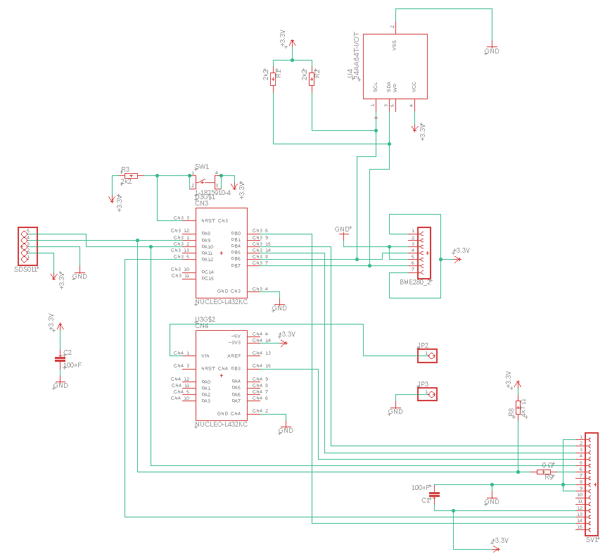

### Block diagram old board

Here can you see the block diagram of the old board. This block diagram is a
quick summary of what is on my old board.

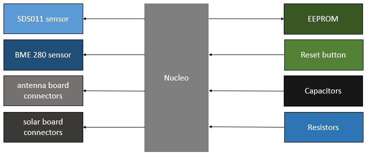

### Board shematic of the old board

On the top of the board you can see 4 holes this is the VCC of the SDS011
sensor. These holes are were provided so you could erase the line and add more
voltage to it from the solar pannel board. These holes were removed on the
newest board.

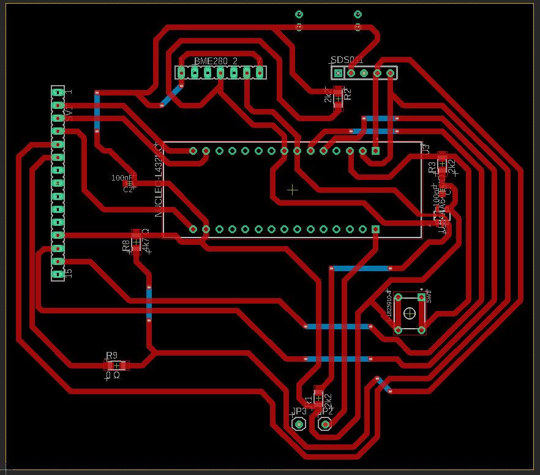

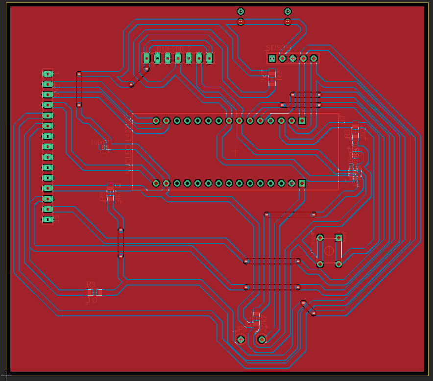

### The print when nothing was soldered

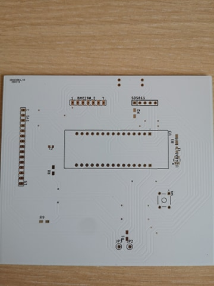

### The print when everything is soldered

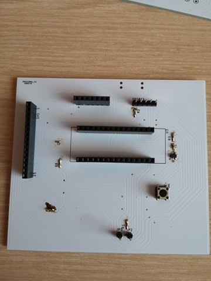

### Testing the SDS011 sensor

1. Setup of the sensor.

   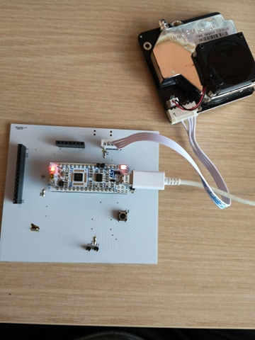

2. Reading the values in putty.

   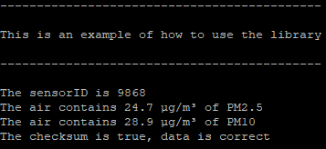

3. Extra information.
    * The pins are connected on D0 and D1.

### Testing the EEPROM driver

1. Setup of the sensor.

   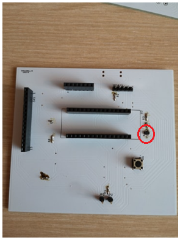

2. Reading out an array in putty.

   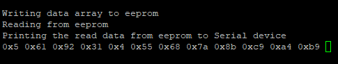

3. Extra information.
    * While testing i connected the pins to D4 and D5.

### Testing the BME280 sensor

I could not test this sensor because i don't have that sensor at home. I tested
it with the fake values from Ladzlo and something was wrong with compiling. But
other people tried this sensor and connected it just like how i connected it in
my shematic so normally it would work perfectly.

1. Setup of the sensor.

   Connect the sensor in the pins in the red circle shown in the picture below.

   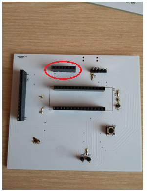

2. Extra information.
    * I connected the BME to pins D4 and D5 on the nucleo.

### Testing antenna PCB board

This test has been executed by Laura this pcb works perfectly together with my
board all the info about the tests can you find in the github repository from
the antenna board.

1. Setup of the boards.

   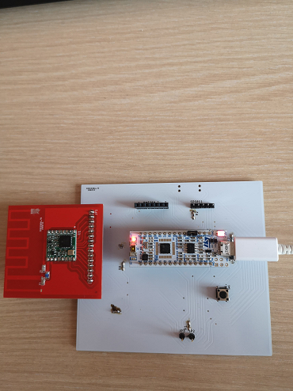

2. Extra information.
    * You can find extra information in the link below.
    * [Link testing LoRaWAN-antenna](https://github.com/vives-projectwerk-2-2020/LoRaWAN-antenna)

### Shematic of the new board

The difference between the old and the new board is that i added extra pins for
the battery pcb and also pins for an extra board so that the voltage can go
from 3V3 to 5V so that the SDS011 sensor can work well. I also added sleep mode
for the SDS011.

Left from the lowest nucleo shematic i added added 3 extra connectors. SV3 is
provided so that the solar board can be connected to my board. SV2 are
connectors to add the extra print that converts te voltage 3V3 to 5V, we have
to do that so that the SDS011 can function well.

Below the SV2 connector there are 2 pins these pins are provided to connect the
wires from the batteries to my pcb. In the board you can also see a lot of
holes. These holes are provided to connect the pcb with the box, the 2 holes in
the center are provided for the batteries you can connect these under the PCB
or above.

In the top left of the shematic you can see i added there also extra components.
These components are provided so that the SDS011 can go in sleep mode. I
connected this to pin D2 on the nucleo, the info about the shematic can you
find in the topic "Adding components to the old board so that the SDS011 sensor
can go in sleep mode" this will be discussed below.

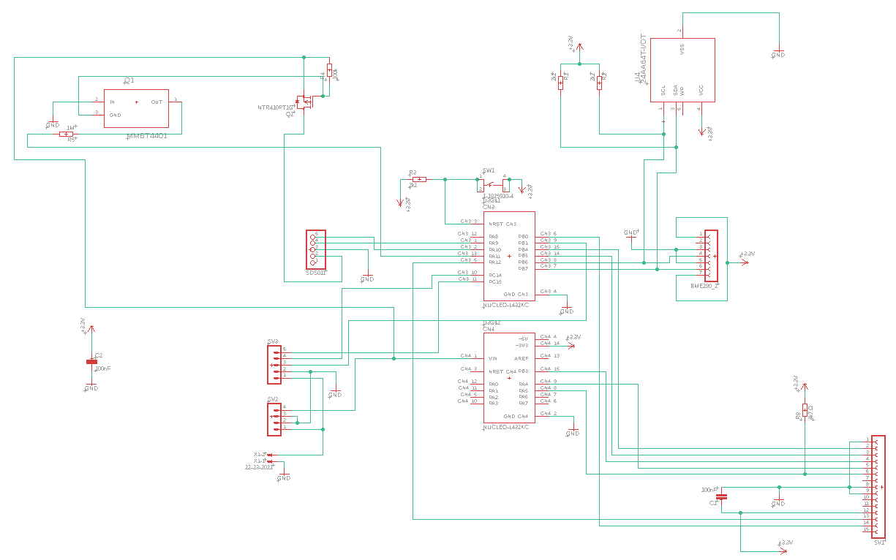

### Adding components for SDS011 sleep mode

I upgraded the old shematic a bit so that the SDS011 sensor can go in sleep
mode. In the picture below you can see the shematic about how to make it.

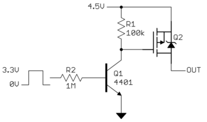

When the digital output goes high, Q1 is turned on. That pulls down the gate of
Q2 low, turning it on.
When the digital output is low, Q1 is held off. R1 then pulls the gate high,
turning off Q2.
R1 was chosen to be so high to minimize the current when the device is powered on.

### Block diagram new board

Here can you see the block diagram of the new board. This block diagram is a
quick summary of what is on my new board.

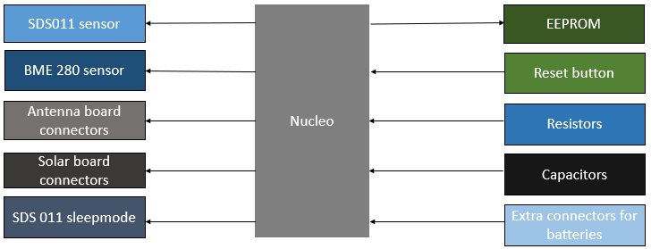

### Board shematic of the new board

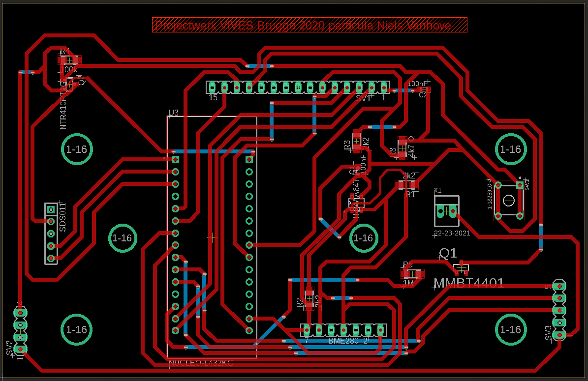

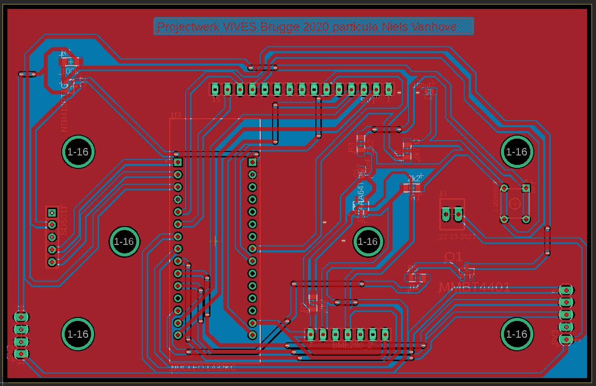

### The waterproof box

All the boards from the hardware needs to be combined in this waterproof box.
In the picture below you can see how we arranged the prints in the box. The grey
sensor board is my board, all the other boards will be connected to my board
with connectors or with holes in the pcb. I can connect also my pcb to the box.
You can see in the picture that the antenna board is far away from the other
pcb's. This is because the antenna may not get malfunctions from other boards.
The part that is not on the picture but in the box are the batteries. You can
add the batteries under my print or add it on top of it with spacers.

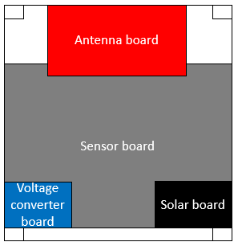 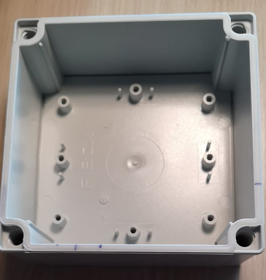

### link to github project

[Prototype board with sensors](https://github.com/vives-projectwerk-2-2020/Prototype_Board_Niels)

### Partlist

* [Female header](https://be.farnell.com/samtec/ssw-107-01-t-s/connector-rcpt-7pos-1row-2-54mm/dp/2667434)
* [Pinheader SDS011](https://be.farnell.com/molex/22-28-4050/connector-header-5pos-1row-2-54mm/dp/2381173)
* [Push button](https://be.farnell.com/c-k-components/pts645sl43-2-lfs/tactile-switch-spst-0-05a-12vdc/dp/2435161)
* [EEPROM](https://be.farnell.com/microchip/24aa64t-i-ot/serial-eeprom-64kbit-400khz-sot/dp/2101260)
* [100 nF capacitor](https://be.farnell.com/avx/02016d104kat2a/cap-0-1-f-6-3v-10-x5r-0201/dp/1657913?st=smd%20capacitor)
* [2k2 ohm resistor](https://be.farnell.com/vishay/crcw06032k20fkeahp/res-2k2-1-0-33w-0603-thick-film/dp/1738909?st=2k2%20smd%20resistor)
* [100k ohm resistor](https://be.farnell.com/vishay/crcw0402100kfked/res-100k-1-0-063w-0402-thick-film/dp/1469671?st=100k%20smd%20resistor)
* [1M ohm resistor](https://be.farnell.com/vishay/crcw04021m00fked/res-1m-1-0-063w-0402-thick-film/dp/1469667?st=1M%20smd%20resistor)
* [4k7 ohm resistor](https://be.farnell.com/vishay/crcw06034k70fkea/res-4k7-1-0-1w-0603-thick-film/dp/1469807?st=4k7%20smd%20resistor)
* [15 pins Female header](https://be.farnell.com/harwin/m20-7821546/connector-rcpt-15pos-2-54mm-1row/dp/3225931)
* [4 pins Female header](https://be.farnell.com/multicomp/2212s-04sg-85/socket-pcb-1-row-4way/dp/1593460)
* [5 pins Female header](https://be.farnell.com/multicomp/2212s-05sg-85/socket-pcb-1-row-5way/dp/1593461)
* [2 pins Male header](https://be.farnell.com/amp-te-connectivity/5-146281-2/board-board-connector-header-2/dp/1792060)
* [Nucleo](https://be.farnell.com/stmicroelectronics/nucleo-l432kc/dev-board-nucleo-32/dp/2580786?scope=partnumberlookahead&ost=NUCLEO-L432KC&searchref=searchlookahead&exaMfpn=true&ddkey=https%3Anl-BE%2FElement14_Belgium%2Fw%2Fsearch)
* [Transistor](https://be.farnell.com/on-semiconductor/mmbt4401lt1g/transistor-npn-sot-23/dp/1459105?st=MMBT4401)
* [Mosfet](https://be.farnell.com/on-semiconductor/ntr4101pt1g/mosfet-p-20v-sot-23/dp/1431303?st=NTR4101PT1G%20P-Channel%20MOSFET)

## The LoRaWAN-antenna board

This is the explanation of how the antenna PCB board came.
And how you can make one yourself.
This PCB described here must then be connected to the main PCB.
Below you can see what it looks like.

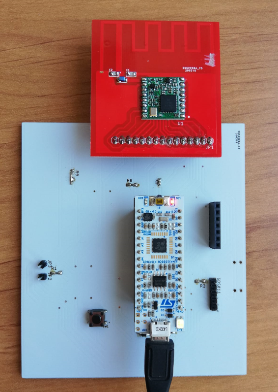

This Antenna on the board is based on
[this](http://www.ti.com/lit/an/swra228c/swra228c.pdf) design.

### Explanation of the Antenna PCB board

Below you see the antenna board. The PCB antenna on this board is suitable for
 a frequency around 868MHz.

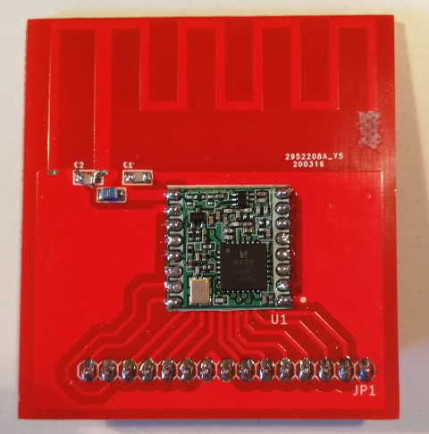

The antenna will work most efficiently if it is resonant. When it is resonant,
 the maximum power will be radiated by the antenna.
 If an antenna is not resonant, some of the power will not be transmitted.
 The power is reflected back to the transmitter (in our case the RF96 module).

Because of the reflection you have a RF power loss and you could damage
 the RF96 module and also reduce your transmission range.

You can solve this by doing 2 things:

* Adjust the length of the antenna and,
* add a matching network.

This is discussed below here.

#### Adjust length

You can adjust the length here, by scratching away some copper at the end
 of the antenna. The total length of the last piece of the antenna is 1,25 cm
  (measured from the outer corner). See the image below for clarification.

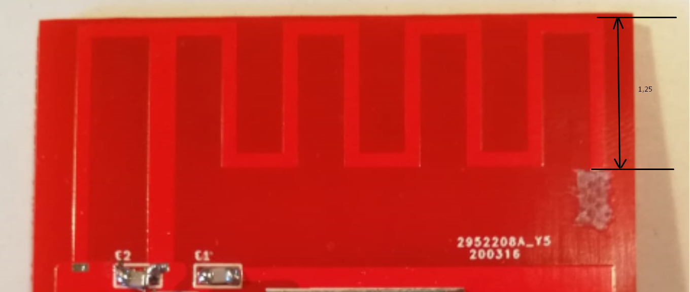

By adjusting the length of the antenna, the antenna is now al more suitable for 868MHz.

#### Matching network

By adding a matching network now, we can improve the impedance of the antenna more.

The network for adjusting the impedance is a PI network.
 Below you can see the schematic of the network.
 The left side of the math unit is connected to the
 RF96 (the antenna output = pin 9). The right side of the unit is connected
 to the antenna.

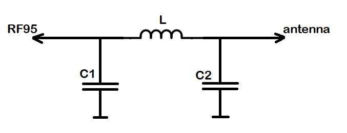

You can observe the matching network below. This consists of 2 capacitors and 1
 coil. The values of the capacitors are 2,2pF. The value of the coil is 12nH.

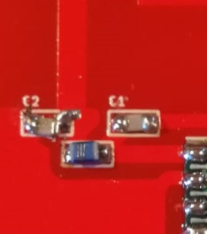

Due to mismatches in impedance, some of the signal is reflected.
 The ratio of the input to the reflected signal is called the Voltage Standing
 Wave Ratio (VSWR). This ratio can also be measured in dB, and
 expressed as Return Loss.

Below you can see that the VSWR at 868MHz is 1.112. This mean that you're
 return lose is 25.510dB. This is very good, because now less than 1% of
 the power goes back to the module. This means that more than 99% of the power
 is used for the communication.

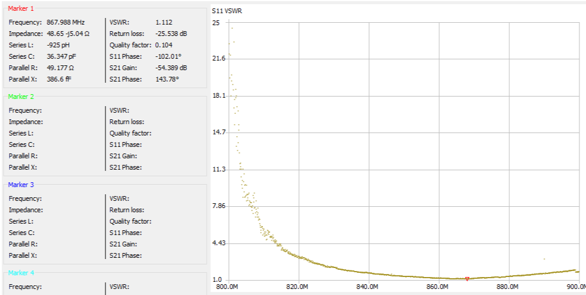

The dimensions of the PCB are also very important. If the dimensions
 are different from here, you must again determine the length and the matching network.

#### RF96

The RF96 module is a module suitable for ultra-long range spread spectrum
 communications. This module has a 20 dBm power amplifier. This means that you
 have an output power of 100mW. Because the impedance is now correct, all power
 will also be radiated effectively.
 For more information about the specifications, you can look in the [datasheet](https://cdn.sparkfun.com/assets/learn_tutorials/8/0/4/RFM95_96_97_98W.pdf).

Below you see the RF95 module. All pins are brought out through the pins.
 Except the pin that goes to the antenna.
This PCB is then clicked on the main PCB.

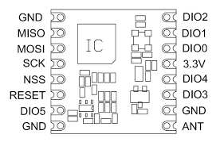

#### schematic and print in Eagle

Here you can see the schematic drawn in Eagle. At the top you see the pins,
 these are then connected to the main PCB. below that you see the RF96 chip.
In the middle you see the matching network, which ensures a correct impedance.
The square block on the right is the symbol for your antenna.
 It is a symbol whose foodprint is the shape of the antenna.

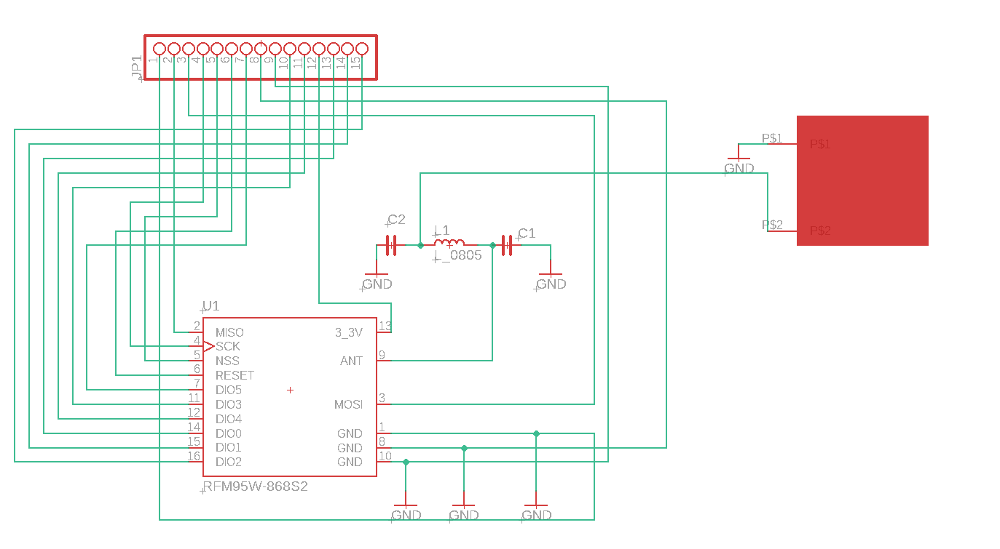

Below you can see what the PCB looks like in eagle.

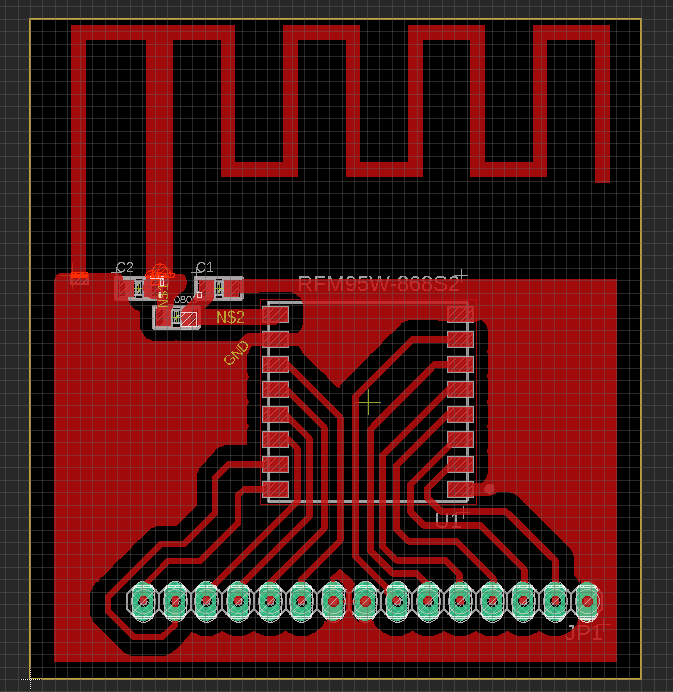

#### tests that happened

You can view the tests
 [[here](https://github.com/vives-projectwerk-2-2020/LoRaWAN-antenna/tree/master/testing)].

### Make it yourself

#### Develop the PCB

First you need to develop the PCB. You can do this by sending a zip to a manufacturer.
Like for example with this manufacturer([JLCPCB](https://jlcpcb.com/)).
The ZIP file is located in the root and is called 'LoRaWAN_antenna.zip'.
check out [this](https://github.com/vives-projectwerk-2-2020/LoRaWAN-antenna) github
You can download and upload this on the manufacturer's website.
If you want to make changes to the PCB you can edit it in the folder 'PCB-antenna-eagle'.

#### Order the components

Then you have to order the components. These are the components:

* [coil (12nH)](https://be.farnell.com/te-connectivity/36502a12njtdg/inductor-12n-5-0805-case/dp/1265504?st=)
* [capacitors (2.2pF)](https://be.farnell.com/vishay/vj0805a2r2bxapw1bc/cap-2-2pf-50v-c0g-np0-0805/dp/2896503?st=)
* [RF96 module](https://www.digikey.be/product-detail/en/seeed-technology-co.,-ltd/109990166/1597-1488-ND/7033232?utm_adgroup=RF%20Transceiver%20Modules&utm_source=google&utm_medium=cpc&utm_campaign=Shopping_Product_RF%2FIF%20and%20RFID&utm_term=&productid=7033232&gclid=CjwKCAjwqpP2BRBTEiwAfpiD-0hUd9VhSiN13Y9OhOWbJ38YxABk0f2ujbqdI1xJR1xy0auqC77hRBoC65kQAvD_BwE)
* [male pins](https://be.farnell.com/harwin/m20-9990846/connector-header-tht-2-54mm-8way/dp/1022257)

for 1 PCB you need 2 capacitors, 1 coil, 1 RF95 module and 15 male pins.

#### Solder everything together

If you then have your PCB and components, you can start soldering.
You should not scratch the antenna anymore,
 I have already adjusted this in the last version.
For soldering it is best to start with the RF96 module
 and then the capacitors and the coil.
Then solder the pins on the last.

### Placing the installation

If you have connected all the boards(main + solar + antenna), you can place
 this where you want.
There are some things to keep in mind:

* Place the installation in a place where connections can be made to a gateway.
On [this](https://www.thethingsnetwork.org/map) map you can see where there
 is a gateway. If you want a map where you can see the range,
 it is best to use [this map](https://ttnmapper.org/).

* Place the installation as high as possible.
The higher, the fewer obstacles in the way and the greater the chance of
 connecting to a gateway.

* Do not place the antenna under the solar panels or next to the solar panels.
Because this will ensure that a lot of your range is gone.

* The box you use should not be made of metal or a substance containing metal.
 [This](http://www.farnell.com/datasheets/2360495.pdf?_ga=2.70667346.396449874.1589637555-1552518953.1588835899&_gac=1.258009592.1589039175.CjwKCAjwqdn1BRBREiwAEbZcR9CB4ETaMQ7lKFncoM-7RMHN5OMiYtTP339AnwNVqZjWkSkDVfl0shoCSGMQAvD_BwE)
 box is ideal. The material from which the box is made is Polycarbonate.
 This does not contain metal.

* The box with should be placed freely, not against a wall.
Also make sure you are at a certain height.

* Make sure the box is not completely closed.
It is best to make 1 or 2 small holes at the bottom so that moisture
can escape if condensation forms.

## Boost converter

### Description boost converter

The solar charge board can only deliver 3V3 so we had to make a board that's
convert the 3V3 to 5V. We need to do this because the SDS011 sensor has to work
on 5V.

### Shematic of the boost converter

In this shematic you can see one big central component the MCP1640CT-I/MC. This
component is a synchronous boost regulator with true output disconnect or
input/output bypass option. This boost regulator is a DC-DC converter. There
are also pins (SV1) provided to connect this board to the sensor board. On the
shematic you can also see a coil we needed to put this in the shematic othewise
it was not possible to get the 3V3 to 5 V. There are also other components
like resistors and capacitors.

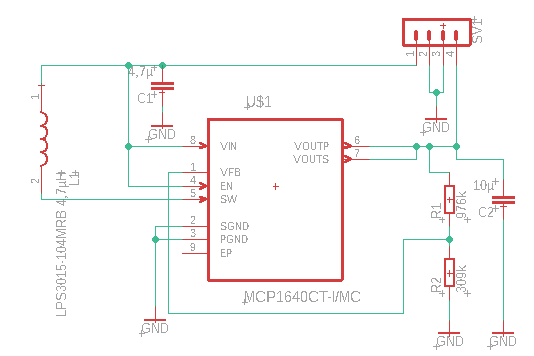

### Board shematic of the boost converter

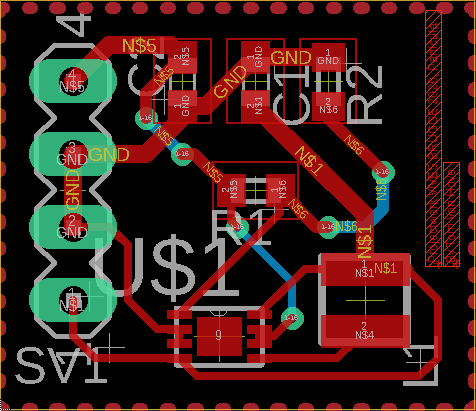

### Pin layout boost regulator

Here you can see the pin layout of the MCP1640CT-I/MC synchronous boost regulator.

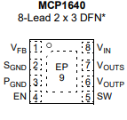

### Link to project boost converter

[Github boost converter](https://github.com/vives-projectwerk-2-2020/BoostConverter)

### Partlist boost converter

* [4.7 µF capacitor](https://be.farnell.com/taiyo-yuden/lmk107bj475ka-t/cap-4-7-f-10v-10-x5r-0603/dp/2112745?ost=2112745&ddkey=https%3Anl-BE%2FElement14_Belgium%2Fsearch)
* [10 µF capacitor](https://be.farnell.com/murata/grm188c81c106ma73d/cap-10-f-16v-20-x6s-0603/dp/2470486?ost=2470486&ddkey=https%3Anl-BE%2FElement14_Belgium%2Fsearch)
* [4.7 µH power inductor](https://be.farnell.com/coilcraft/lps4018-472mrb/inductor-4-7uh-20-1-3a-shld-smd/dp/2408103?st=4.7%20%C2%B5H%20inductor)
* [976 kohm resistor](https://be.farnell.com/multicomp/mcwr06x9763ftl/res-976k-1-0-1w-0603-thick-film/dp/2694973?ost=2694973&ddkey=https%3Anl-BE%2FElement14_Belgium%2Fsearch)
* [309 kohm resistor](https://be.farnell.com/vishay/crcw0603309kfkea/res-309k-1-0-1w-0603-thick-film/dp/2138544?st=2138544)
* [4 male pins](https://be.farnell.com/amp-te-connectivity/826629-4/header-1row-4way/dp/3418303?ost=3418303&ddkey=https%3Anl-BE%2FElement14_Belgium%2Fsearch)
* [Boost regulator](https://www.digikey.be/products/nl?keywords=MCP1640CT-I%2FMCCT-ND)
