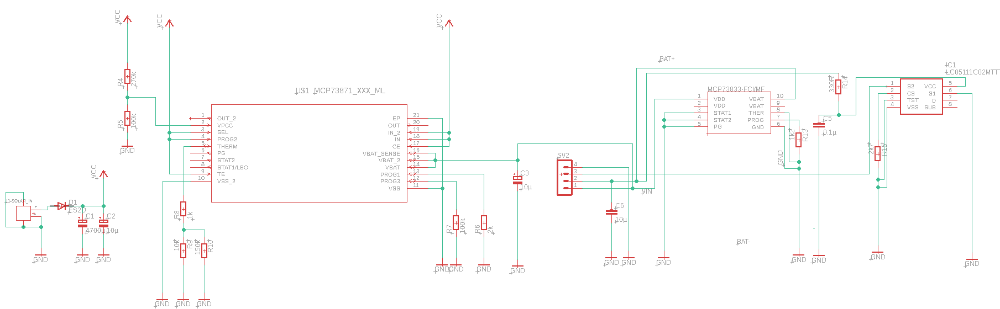

# Hardware

## Battery Charge System

### Description

This panel provide a charge system for charing the batteries via a solar cell.
It seems to be very easy to make this, but actually there comes a lot to play
in the game.
You'll read here how I made this PCB.

#### Develop boards

I first started with some development boards. These PCB's are for sell on the web.
I got 3 boards, so I need to find out witch one was the best for our project.
In this table you'll see the difference between those development boards.

|Feature|Solar Charge Shield V2.2|Adafruit MCP73871|Sparkfun LiPo USB charger|
| -----------------|:------:|:-----:|:-------:|
| **Output disconect** | X  |    |    |
| **Short circuit protection** | X  | X   |   |
| **3W output power when connecting battery** | X    |   | X    |
| **Continious charge current**| X  | X | x  |
| **Battery status indication** | X   | X    |   |
| **Micro USB connection** | X   | X    | X    |
| **Load sharing** |  | X   |    |
| **Temperature monitoring**  |  | X    | X   |
| **Possible to add extra leds** |  | X   |  |
| **Lithium - Polymer batteries** |    | X   | X   |
| **Lithium - Ion batteries** | X   | X   | X   |

I worked together with my classmate Niels to find out with PCB was the best.
We came to a conclusion that the Adafruit board was the best for us.
So the next step was to find oud how it works and how we need to setup the prototype.

##### More information about the development board

##### Specifications

* 3.7V/4.2V Lithium Ion or Lithium Polymer battery charger
* Charge with 5-6V DC, USB or 6V solar panel!
* Automatic charging current tracking for high efficiency use of any wattage
solar panel
* Use any 6V solar panel
* Three color indicator LEDs - Power good, Charging and Done
* Low Battery Indicator (fixed at 3.1V) with LED output on (labeled CHRG)
* Set for 500mA max charge rate, can be adjusted from 50mA up to 1A by soldering
in a resistor
* Will always draw the most current possible from a solar cell- up to the max
charge rate!
* Smart load sharing automatically uses the input power when available, to keep
battery from constantly charging/discharging
* Temperature monitoring of battery by soldering in a 10K NTC thermistor
[thermistor](http://adafru.it/372) (not included) - suggested for outdoor projects
where the battery may get hot (50°C) or cold (0°C).

##### Indicator led's

* The red PWR LED indicates that there is good power connected to the charger.
If this LED is not lit, something is wrong with the power supply
* The orange CHRG LED indicates current charging status. When this LED is lit,
the charger is working to charge up a battery! It also acts as a low battery
indicator (fixed at 3.1V) when no power is connected. So, if you don't have
USB/Solar wired up, when the battery voltage drops below 3.1V, the orange LED
will come on.
* The green DONE LED is pretty easy to understand as well - when it's lit the
battery is charged up! Very handy for when you want to know that everything is done.

##### Extra features

* Load Sharing
* Temperature monitoring
* Adjusting the max charge current
* Adding external LEDs

This was quite easy.
In the picture below you'll see how is set this configuration up.

In the first pic it's the concept of the configuration.

This system was well tested, so I did some measurements  to see how good it works.
You can see some pictures of the measurements below

##### Charge voltage

As we can see, the batteries are supplied with a voltage of 4.3V. A Li-Ion battery
of 3.7V loads until it reaches 4.2V. You can see in the picture of the battery
voltage, that he isn't charged fully. So The charge current is maximum.

##### Charge current

When the battery voltage raises, the charge current will go down. When 4.2V is
reached, the charge current is 0A.
So the current you see on the display, is near maximum.

##### Battery voltage

The battery voltage is not high, the voltage will go to 4.2V.

##### solar panel voltage

The solar panel provides a voltage of near 7V. This is quite high! In my own
PCB I'll need to protect my main IC from this high voltage.

### Our own design

#### Description of my own design

I used the development boards to look for some inspiration, so I could (easily)
make my own design. I started with a prototype, and I'll explain how this works.

#### Schematic

##### Description of the schematic

This is the prototype schematic with actually some bugs in it.
The first IC (MCP73871) manages the battery. This was the same IC of the
development board. He'll keep track on the charge current and voltage. When the
battery is charged, the charge current will be 0 because this IC will drop it down.
There is also a possibility to get some information via the PG, STAT1, STAT2 pins.
These aren't provided here, but in the final PCB it does. This IC takes the
voltage from the solar panel and have's an output of 4.3V.

The second IC is a battery management IC too, this will cause problems. You'll
see in the final PCB that this IC is deleted. In first place I thought that it
was necessary to provide a protection circuit for the battery. But the MCP73871
haves already this functionality. So I will discuss my problems later in this
document, and will explain there what went wrong.

The other components are some interfacing for these IC's.

#### Board

##### Description of the board

The next step was to draw the board. This is quite easy. The first picture is
the schematic witout polygon, the second one is the PCB with polygon. We let
these PCB's made in Japan. Via [JLCPCB](http://JLCPCB.com). Then we bought our
components by Farnell for fast shipping. When we got all components and boards,
we could start soldering. Me and my colleagues are used to solder, so this
wasn't any problem for us.

In this pic you'll see the unsoldered and soldered PCB

#### Description of the final design

You can find here the link to the GitHub repo of the schematic, board and partlist.
[GitHub repo final design](https://github.com/vives-projectwerk-2-2020/FinalSolarChargeSystem)

#### Final Schematic

##### Description of the final schematic

As you can see here, the other IC's are removed. This because they have the same
functionality as the MCP73871. I placed a voltage regulator before the IC, this
is because you can have a max voltage of 6V on the IC, and the solar panel
provides 6+V.
Here I brought the STAT1, STAT2 and PG pins outside, so we can manage the battery
on the Nucleo.
This PCB will fit on the main PCB (See Niels his documents).

#### Final Board

##### Description of the final Board

There is not so much to tell about it, here to, just draw the wires.
We couldn't order these PCB's because of the COVID-19 pandemic.

### Tests

When we had the prototype PCB, we soldered them, and then we need to test if they
really work.

When I tested the PCB without a battery connected, the charge voltage was 4.2V.
This was really good, that worked. But when I attached a battery, the system
falls down after 2 minutes. So is started looking for the problem. And as you
could see, there is a difference between the prototype PCB and the final PCB.
1 IC in stead of 3. This was because the MCP73871 have same functionality of all
those other IC's. So I don't need them. What was the source of the problem? Well,
the MCP73871 checked the battery status, but he actually checked the MCP83833
and this IC wasn't a battery, so the MCP73871 shuts down because he thought that
te battery was fully charged.
When scratching away the wire tot the MCP83833, the PCB worked like it need to be!

After this, is started a duration test. I made a setup with a Arduino UNO to
have a current taken away from the battery.
The charge PCB was still connected to the batteries.
The setup have been outside for 3 - 4 weeks, day and night.
In the picture below, you'll see the setup I made.

I went daily for a measurement of the PCB. I measured the voltage of the solar
panel, IC input, IC output, battery voltage and charge current.
|Measurement    | Value         |
|---------------|---------------|
|Solar panel    |6,8V           |
|IC input       |5V             |
|IC output      |4,2V           |
|Battery voltage|3V - 4.2V      |
|charge current |0mA - 100mA    |

The charge current depends on the weather. When it is a nice day, you'll reach
higher current measurements. The charge current depends on the battery voltage
too. When the battery voltage reaches 4.2V, the current will drop town to 0.

How I did these measurements, can be found in mij Youtube video.

### Links

* [MCP73871 datasheet](http://adafru.it/aMO)
* [Fritzing object in Adafruit Fritzing library](http://adafru.it/aP3)
* [EagleCAD Board / Layout & Schematic files on Github](http://adafru.it/aMP)

## The LoRaWAN-antenna board

This is the explanation of how the antenna PCB board came.
And how you can make one yourself.
This PCB described here must then be connected to the main PCB.
Below you can see what it looks like.

This Antenna on the board is based on
[this](http://www.ti.com/lit/an/swra228c/swra228c.pdf) design.

### Explanation of the Antenna PCB board

Below you see the antenna board. The PCB antenna on this board is suitable for
 a frequency around 868MHz.

The antenna will work most efficiently if it is resonant. When it is resonant,
 the maximum power will be radiated by the antenna.
 If an antenna is not resonant, some of the power will not be transmitted.
 The power is reflected back to the transmitter (in our case the RF96 module).

Because of the reflection you have a RF power loss and you could damage
 the RF96 module and also reduce your transmission range.

You can solve this by doing 2 things:

* Adjust the length of the antenna and,
* add a matching network.

This is discussed below here.

#### Adjust length

You can adjust the length here, by scratching away some copper at the end
 of the antenna. The total length of the last piece of the antenna is 1,25 cm
  (measured from the outer corner). See the image below for clarification.

By adjusting the length of the antenna, the antenna is now al more suitable for 868MHz.

#### Matching network

By adding a matching network now, we can improve the impedance of the antenna more.

The network for adjusting the impedance is a PI network.
 Below you can see the schematic of the network.
 The left side of the math unit is connected to the
 RF96 (the antenna output = pin 9). The right side of the unit is connected
 to the antenna.

You can observe the matching network below. This consists of 2 capacitors and 1
 coil. The values of the capacitors are 2,2pF. The value of the coil is 12nH.

Due to mismatches in impedance, some of the signal is reflected.
 The ratio of the input to the reflected signal is called the Voltage Standing
 Wave Ratio (VSWR). This ratio can also be measured in dB, and
 expressed as Return Loss.

Below you can see that the VSWR at 868MHz is 1.112. This mean that you're
 return lose is 25.510dB. This is very good, because now less than 1% of
 the power goes back to the module. This means that more than 99% of the power
 is used for the communication.

The dimensions of the PCB are also very important. If the dimensions
 are different from here, you must again determine the length and the matching network.

#### RF96

The RF96 module is a module suitable for ultra-long range spread spectrum
 communications. This module has a 20 dBm power amplifier. This means that you
 have an output power of 100mW. Because the impedance is now correct, all power
 will also be radiated effectively.
 For more information about the specifications, you can look in the [datasheet](https://cdn.sparkfun.com/assets/learn_tutorials/8/0/4/RFM95_96_97_98W.pdf).

Below you see the RF95 module. All pins are brought out through the pins.
 Except the pin that goes to the antenna.
This PCB is then clicked on the main PCB.

#### schematic and print in Eagle

Here you can see the schematic drawn in Eagle. At the top you see the pins,
 these are then connected to the main PCB. below that you see the RF96 chip.
In the middle you see the matching network, which ensures a correct impedance.
The square block on the right is the symbol for your antenna.
 It is a symbol whose foodprint is the shape of the antenna.

Below you can see what the PCB looks like in eagle.

#### tests that happened

You can view the tests
 [[here](https://github.com/vives-projectwerk-2-2020/LoRaWAN-antenna/tree/master/testing)].

### Make it yourself

#### Develop the PCB

First you need to develop the PCB. You can do this by sending a zip to a manufacturer.
Like for example with this manufacturer([JLCPCB](https://jlcpcb.com/)).
The ZIP file is located in the root and is called 'LoRaWAN_antenna.zip'.
check out [this](https://github.com/vives-projectwerk-2-2020/LoRaWAN-antenna) github
You can download and upload this on the manufacturer's website.
If you want to make changes to the PCB you can edit it in the folder 'PCB-antenna-eagle'.

#### Order the components

Then you have to order the components. These are the components:

* [coil (12nH)](https://be.farnell.com/te-connectivity/36502a12njtdg/inductor-12n-5-0805-case/dp/1265504?st=)
* [capacitors (2.2pF)](https://be.farnell.com/vishay/vj0805a2r2bxapw1bc/cap-2-2pf-50v-c0g-np0-0805/dp/2896503?st=)
* [RF96 module](https://www.digikey.be/product-detail/en/seeed-technology-co.,-ltd/109990166/1597-1488-ND/7033232?utm_adgroup=RF%20Transceiver%20Modules&utm_source=google&utm_medium=cpc&utm_campaign=Shopping_Product_RF%2FIF%20and%20RFID&utm_term=&productid=7033232&gclid=CjwKCAjwqpP2BRBTEiwAfpiD-0hUd9VhSiN13Y9OhOWbJ38YxABk0f2ujbqdI1xJR1xy0auqC77hRBoC65kQAvD_BwE)
* [male pins](https://be.farnell.com/harwin/m20-9990846/connector-header-tht-2-54mm-8way/dp/1022257)

for 1 PCB you need 2 capacitors, 1 coil, 1 RF95 module and 15 male pins.

#### Solder everything together

If you then have your PCB and components, you can start soldering.
You should not scratch the antenna anymore,
 I have already adjusted this in the last version.
For soldering it is best to start with the RF96 module
 and then the capacitors and the coil.
Then solder the pins on the last.

### Placing the installation

If you have connected all the boards(main + solar + antenna), you can place
 this where you want.
There are some things to keep in mind:

* Place the installation in a place where connections can be made to a gateway.
On [this](https://www.thethingsnetwork.org/map) map you can see where there
 is a gateway. If you want a map where you can see the range,
 it is best to use [this map](https://ttnmapper.org/).

* Place the installation as high as possible.
The higher, the fewer obstacles in the way and the greater the chance of
 connecting to a gateway.

* Do not place the antenna under the solar panels or next to the solar panels.
Because this will ensure that a lot of your range is gone.

* The box you use should not be made of metal or a substance containing metal.
 [This](http://www.farnell.com/datasheets/2360495.pdf?_ga=2.70667346.396449874.1589637555-1552518953.1588835899&_gac=1.258009592.1589039175.CjwKCAjwqdn1BRBREiwAEbZcR9CB4ETaMQ7lKFncoM-7RMHN5OMiYtTP339AnwNVqZjWkSkDVfl0shoCSGMQAvD_BwE)
 box is ideal. The material from which the box is made is Polycarbonate.
 This does not contain metal.

* The box with should be placed freely, not against a wall.
Also make sure you are at a certain height.

* Make sure the box is not completely closed.
It is best to make 1 or 2 small holes at the bottom so that moisture
 can escape if condensation forms.

## main pcb
